# Spotify Clone

A feature-rich, responsive Spotify clone built with React, Redux, and Material-UI. This project mimics the core user interface and functionality of the Spotify web player, providing a seamless and modern music browsing experience.

## Screenshots

Here are snapshots showcasing the various features of the application.

### 🏠 Home & Library
| Welcome Page with Recommendations | Library - Playlists View |
| :---: | :---: |
| 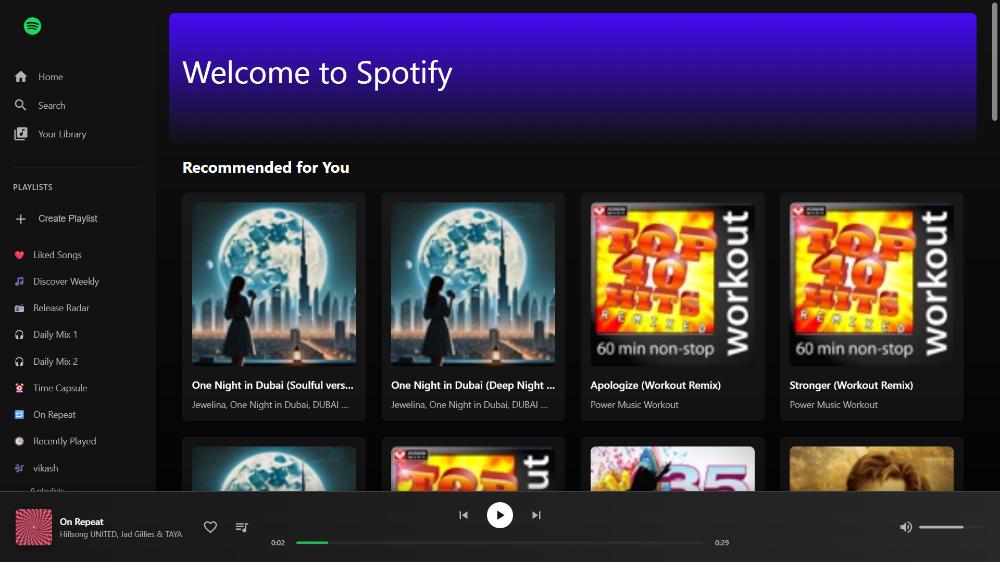 | 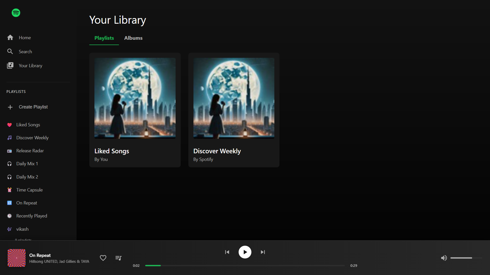 |

| Library - Albums View | Liked Songs |
| :---: | :---: |
|  | 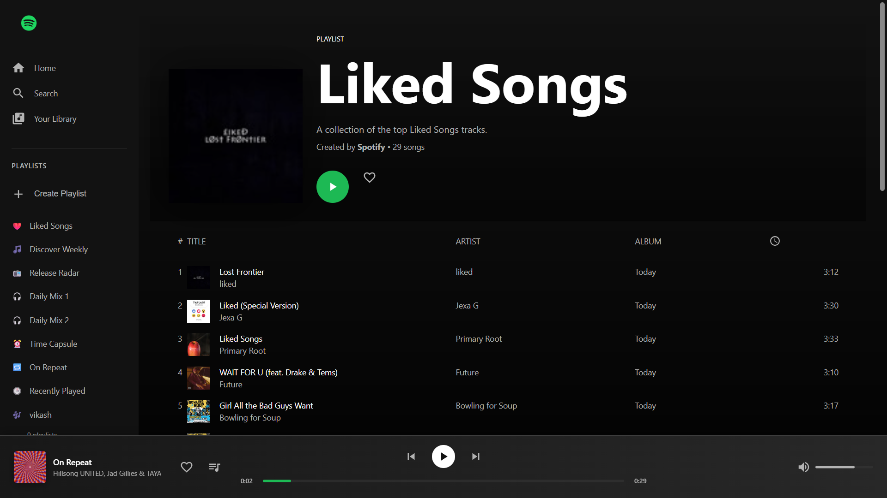 |

### 🔍 Search & Discovery
| Browse Genres | Search Results - Top Hits |
| :---: | :---: |
| 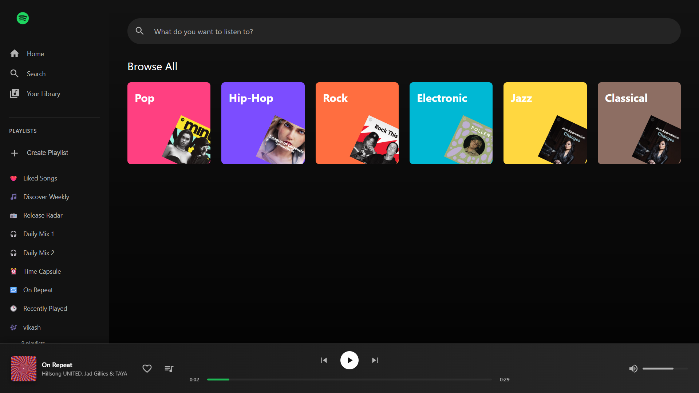 | 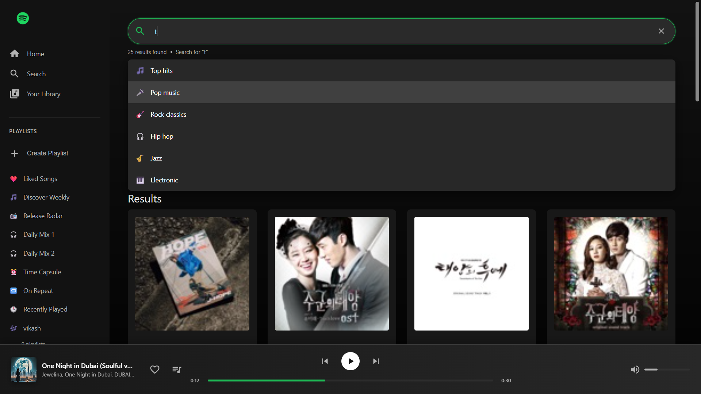 |

| Search Results - Rock Classics | Create Playlist Modal |
| :---: | :---: |
| 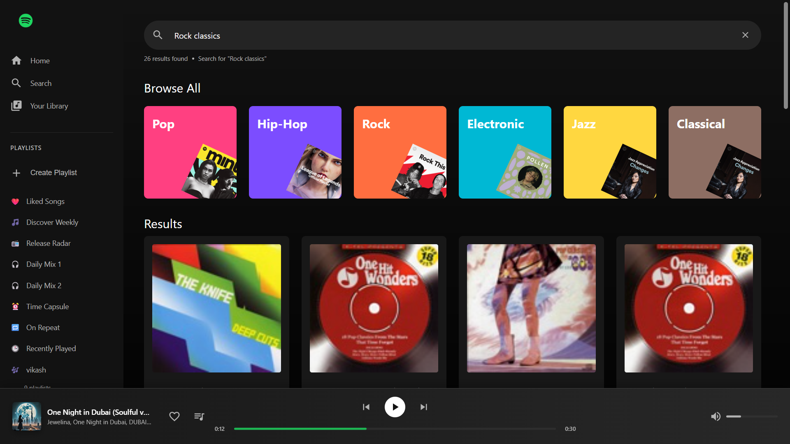 |  |

### 📱 Playlists & Content
| Discover Weekly | Release Radar |
| :---: | :---: |
|  | 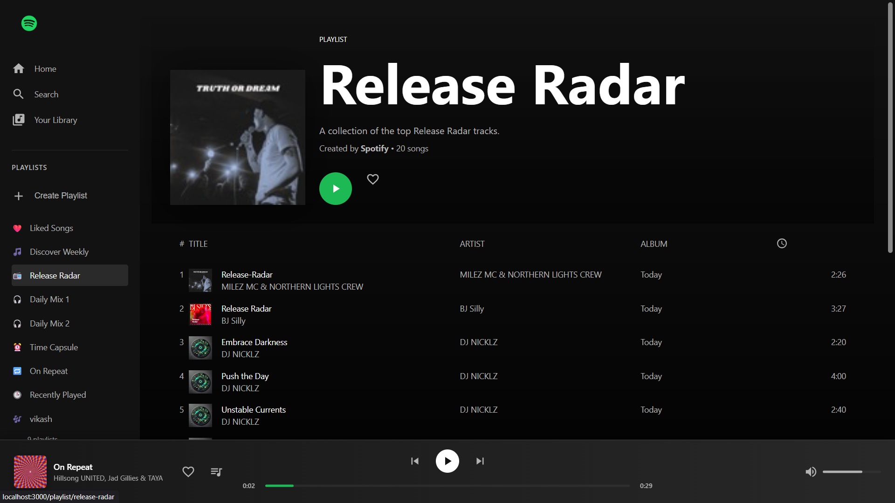 |

| Daily Mix 1 | Daily Mix 2 |
| :---: | :---: |
| 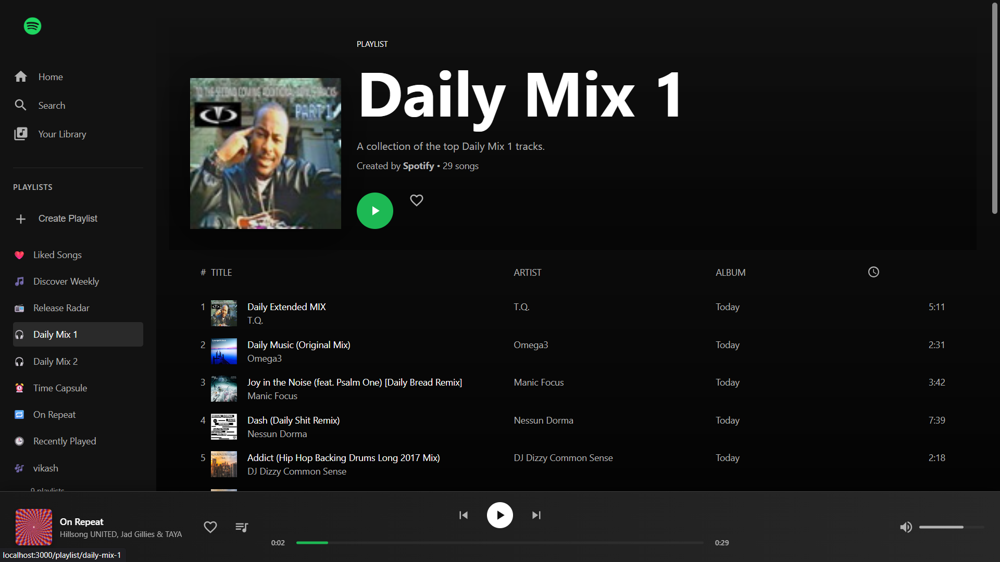 | 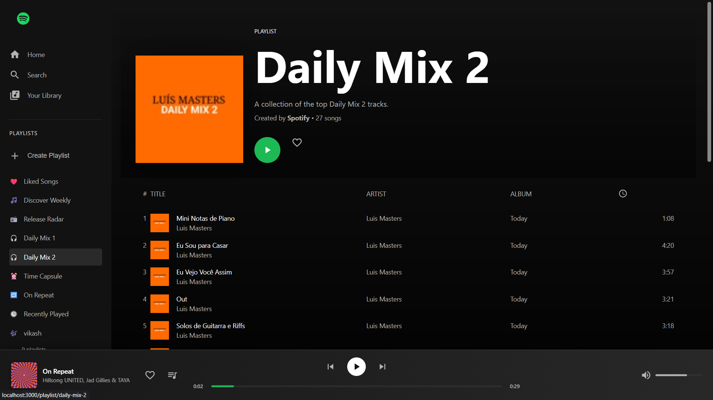 |

| Time Capsule | On Repeat |
| :---: | :---: |
| 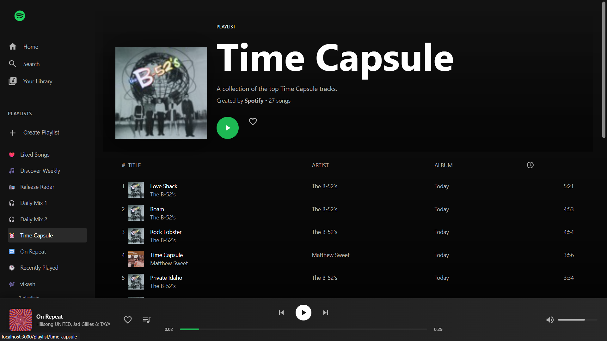 | 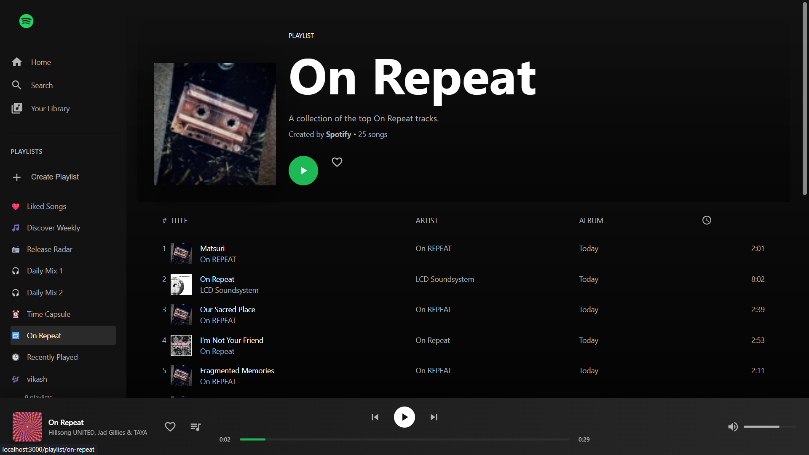 |

| Recently Played | Custom Playlist |
| :---: | :---: |
| 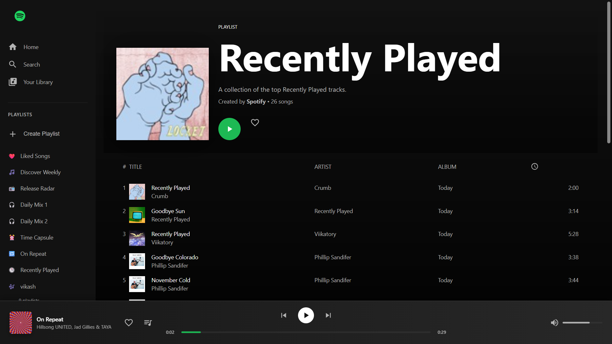 | 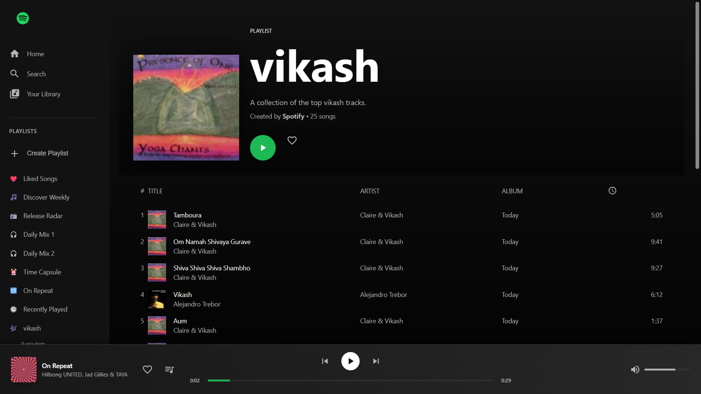 |

## ✨ Features

- **Modern & Responsive UI**: A pixel-perfect replica of the Spotify interface, fully responsive for desktop and tablet sizes.
- **Music Player Controls**: Fully functional player with play, pause, next, previous, seek, and volume controls.
- **Dynamic Content**:
  - **Home Page**: Displays top charts, new releases, and recommended tracks.
  - **Search**: Search for tracks and browse genres with a sleek, interactive search bar.
  - **Artist & Album Pages**: View detailed pages for artists and albums.
- **Playlist Management**:
  - Dynamically generated playlists like "Discover Weekly," "Liked Songs," and more.
  - **Create custom playlists**: Users can create their own playlists with a modern modal interface, saved to `localStorage`.
- **State Management**: Centralized state management with Redux Toolkit for a predictable and scalable application state.
- **Routing**: Seamless client-side routing with React Router.
- **Styled Components**: Utilizes styled-components for scoped, dynamic, and reusable styling.


## 🚀 Tech Stack

- **Framework**: [React](https://reactjs.org/)
- **State Management**: [Redux Toolkit](https://redux-toolkit.js.org/)
- **API Communication**: [RTK Query](https://redux-toolkit.js.org/rtk-query/overview)
- **Styling**: [Styled Components](https://styled-components.com/) & [Material-UI](https://mui.com/)
- **Routing**: [React Router](https://reactrouter.com/)
- **Icons**: [Material Icons](https://mui.com/material-ui/material-icons/)


## 📦 Getting Started

To get a local copy up and running, follow these simple steps.

### Prerequisites

Make sure you have Node.js and npm installed on your machine.
- [Node.js](https://nodejs.org/en/) (v14 or higher)
- [npm](https://www.npmjs.com/get-npm)

### Installation

1. Clone the repository:
   ```sh
   git clone https://github.com/vikash-kushwah/spotify-clone-celebal.git
   ```
2. Navigate to the project directory:
   ```sh
   cd spotify-clone-celebal
   ```
3. Create a `.env` file in the root directory and add your API credentials:
   ```env
   REACT_APP_RAPIDAPI_KEY=your_rapidapi_key_here
   REACT_APP_RAPID_API_HOST=your_rapidapi_host_here
   ```
4. Install NPM packages:
   ```sh
   npm install
   ```

### Running the Application

To start the development server, run the following command:

```sh
npm start
```

The application will be available at `http://localhost:3000`.


## Available Scripts

In the project directory, you can run:

- `npm start`: Runs the app in development mode.
- `npm test`: Launches the test runner in interactive watch mode.
- `npm run build`: Builds the app for production to the `build` folder.
- `npm run eject`: Removes the single dependency configuration (use with caution).


## Project Structure

```
spotify-clone-celebal/
├── public/
│   ├── index.html
│   └── screenshots/
│       ├── spotify-welcome-recommendations.jpg
│       ├── spotify-library-playlists.jpg
│       ├── spotify-library-albums.jpg
│       ├── spotify-browse-genres.png
│       ├── spotify-search-top-hits.jpg
│       ├── spotify-search-rock-classics.jpg
│       ├── spotify-create-playlist-popup.jpg
│       └── ... (other screenshots)
├── src/
│   ├── components/
│   │   ├── common/
│   │   │   ├── CreatePlaylistModal.jsx
│   │   │   ├── Error.jsx
│   │   │   └── Loader.jsx
│   │   ├── Player.jsx
│   │   ├── PlayPause.jsx
│   │   ├── Sidebar.jsx
│   │   └── SongCard.jsx
│   ├── hooks/
│   │   └── usePlaylists.js
│   ├── pages/
│   │   ├── Album.jsx
│   │   ├── Artist.jsx
│   │   ├── Home.jsx
│   │   ├── Library.jsx
│   │   ├── Playlist.jsx
│   │   └── Search.jsx
│   ├── redux/
│   │   ├── features/
│   │   │   └── playerSlice.js
│   │   ├── services/
│   │   │   └── spotifyApi.js
│   │   └── store.js
│   ├── App.js
│   └── index.js
└── package.json
```

## Author

Vikash Kushwah
- GitHub: [vikash-kushwah](https://github.com/vikash-kushwah)

## Acknowledgments

This project was created as part of the Celebal Technologies React internship program.
